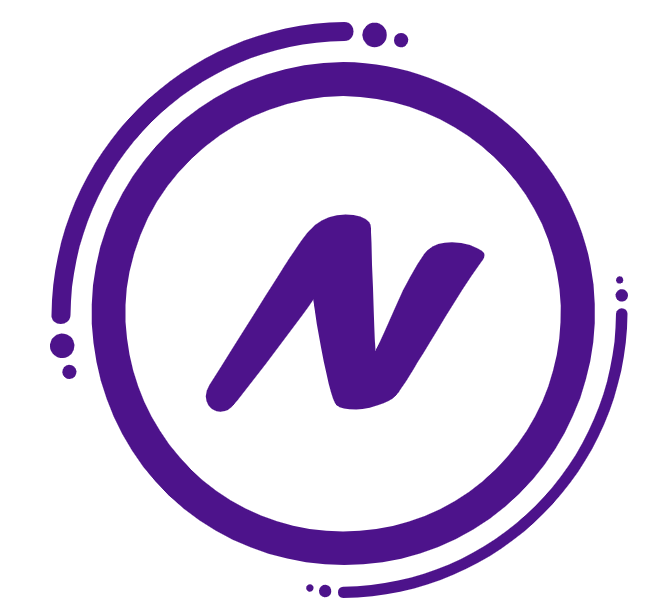

# Notiee - Your Smart Daily Companion



Notiee is a modern, feature-rich Flutter application that serves as your smart daily companion for managing todos and bills. Built with clean architecture principles and powered by Firebase, it offers a seamless and beautiful user experience across all platforms.

## ✨ Features

### 🎨 **Modern UI/UX**
- **Splash Screen**: Beautiful animated splash screen with logo and loading indicators
- **Floating Navigation**: Elegant bottom navigation bar with floating design
- **Material Design 3**: Modern UI components with Indigo color scheme
- **Responsive Design**: Optimized for all screen sizes
- **Smooth Animations**: Delightful transitions and micro-interactions

### 🔐 **Authentication System**
- **Phone-based Authentication**: Login/signup using phone numbers
- **Firebase Authentication**: Secure backend authentication
- **Password Protection**: Encrypted password storage
- **Auto-Navigation**: Smart routing based on authentication state
- **Session Management**: Persistent login sessions

### 📋 **Todo Management**
- **Create Todos**: Add tasks with title and description
- **Edit Todos**: Modify existing tasks
- **Complete Tasks**: Mark todos as completed with visual feedback
- **Delete Todos**: Remove unwanted tasks
- **Real-time Sync**: Live updates across devices via Firebase Firestore
- **Empty State**: Beautiful empty state with helpful guidance

### 💰 **Bills Section**
- **Bills Tab**: Dedicated section for future bill management features
- **Ready for Expansion**: Structured architecture for adding bill tracking

### 🏗️ **Architecture & Technical Features**

#### **Clean Architecture**
- **Domain Layer**: Business logic and entities
- **Application Layer**: Use cases and BLoC state management
- **Infrastructure Layer**: External data sources and repositories
- **Presentation Layer**: UI components and widgets

#### **State Management**
- **Flutter BLoC**: Reactive state management with clear separation of concerns
- **Event-driven**: Predictable state changes through events
- **Stream-based**: Real-time UI updates

#### **Backend & Data**
- **Firebase Core**: Backend infrastructure
- **Firestore**: NoSQL database for todos and user data
- **Firebase Auth**: User authentication and session management
- **Real-time Sync**: Automatic data synchronization

#### **Dependency Injection**
- **GetIt**: Service locator for dependency management
- **Repository Pattern**: Clean separation between data sources and business logic
- **Lazy Loading**: Efficient resource management

## 📱 **Screenshots**

### App Flow
1. **Splash Screen** → **Authentication** → **Main Navigation**
2. **Home Tab** (Todos) ↔ **Bills Tab**
3. **Floating Action Button** → **Add/Edit Todo**

### Navigation Structure
```
├── Splash Screen (/)
├── Authentication
│   ├── Login Page (/login)
│   └── Signup Page (/signup)
├── Main Navigation (/main)
│   ├── Home Tab (Todos)
│   └── Bills Tab
└── Todo Management
    └── Add/Edit Todo (/add_edit_todo)
```

## 🛠️ **Tech Stack**

### **Frontend**
- **Flutter** (SDK ^3.5.3)
- **Dart** (Latest stable)
- **Material Design 3**

### **State Management**
- **flutter_bloc** ^8.1.6
- **equatable** ^2.0.5

### **Backend & Database**
- **Firebase Core** ^3.6.0
- **Firebase Auth** ^5.3.1
- **Cloud Firestore** ^5.4.4

### **Architecture & Utils**
- **get_it** ^7.7.0 (Dependency Injection)
- **dartz** ^0.10.1 (Functional Programming)
- **crypto** ^3.0.3 (Password Hashing)
- **flutter_svg** ^2.2.0 (SVG Support)
- **http** ^1.2.2 (HTTP Requests)

### **Development**
- **flutter_lints** ^4.0.0
- **flutter_test** (Testing framework)

## 🚀 **Getting Started**

### **Prerequisites**
- Flutter SDK (^3.5.3)
- Dart SDK (Latest)
- Firebase Project Setup
- Android Studio / VS Code
- iOS/Android development environment

### **Installation**

1. **Clone the Repository**
   ```bash
   git clone [repository-url]
   cd notiee
   ```

2. **Install Dependencies**
   ```bash
   flutter pub get
   ```

3. **Firebase Setup**
   - Create a Firebase project
   - Add Android/iOS apps to Firebase
   - Download and place configuration files:
     - `android/app/google-services.json`
     - `ios/Runner/GoogleService-Info.plist`
   - Run FlutterFire configure:
     ```bash
     flutterfire configure
     ```

4. **Run the App**
   ```bash
   flutter run
   ```

### **Building for Production**

#### **Android**
```bash
flutter build apk --release
# or for app bundle
flutter build appbundle --release
```

#### **iOS**
```bash
flutter build ios --release
```

## 📁 **Project Structure**

```
lib/
├── core/                          # Core utilities and shared components
│   ├── di/                        # Dependency injection setup
│   ├── errors/                    # Error handling and failures
│   └── utils/                     # Utility functions and constants
├── features/                      # Feature-based modules
│   ├── authentication/            # User authentication
│   │   ├── application/           # BLoC and business logic
│   │   ├── domain/               # Entities and repository contracts
│   │   ├── infrastructure/       # Data sources and implementations
│   │   └── presentation/         # UI components and pages
│   ├── todo/                     # Todo management
│   │   ├── application/          # Todo BLoC and events
│   │   ├── domain/              # Todo models and contracts
│   │   ├── infrastructure/      # Firestore implementation
│   │   └── presentation/        # Todo UI components
│   └── bills/                   # Bills management (future expansion)
│       └── presentation/        # Bills UI components
├── main.dart                    # App entry point
├── home.dart                   # Main navigation page
├── splash_screen.dart          # Animated splash screen
└── firebase_options.dart       # Firebase configuration
```

## 🎯 **Key Features in Detail**

### **Authentication Flow**
- Phone number + password authentication
- Automatic email derivation from phone number
- Plain text password storage
- Firebase Auth integration
- Persistent sessions

### **Todo Management**
- **CRUD Operations**: Create, Read, Update, Delete todos
- **Real-time Updates**: Live synchronization across devices
- **User Isolation**: Each user sees only their todos
- **Rich UI**: Checkboxes, edit/delete actions, completion states
- **Optimistic Updates**: Immediate UI feedback

### **Navigation System**
- **Bottom Navigation**: Floating design with Home and Bills tabs
- **Floating Action Button**: Centered over navigation bar
- **Smart Routing**: Context-aware navigation based on auth state
- **Hero Animations**: Smooth transitions between screens

## 🔮 **Future Enhancements**

### **Planned Features**
- [ ] Bill tracking and management
- [ ] Due date reminders
- [ ] Categories and tags
- [ ] File attachments
- [ ] Dark theme support
- [ ] Offline synchronization
- [ ] Push notifications
- [ ] Data export/backup
- [ ] Collaborative todos
- [ ] Voice input

### **Technical Improvements**
- [ ] Unit and integration tests
- [ ] Performance optimizations
- [ ] Accessibility improvements
- [ ] Internationalization (i18n)
- [ ] Analytics integration
- [ ] Crash reporting
- [ ] CI/CD pipeline

## 🤝 **Contributing**

We welcome contributions! Please follow these steps:

1. Fork the repository
2. Create a feature branch (`git checkout -b feature/amazing-feature`)
3. Commit your changes (`git commit -m 'Add amazing feature'`)
4. Push to the branch (`git push origin feature/amazing-feature`)
5. Open a Pull Request

### **Coding Standards**
- Follow Flutter/Dart style guidelines
- Use clean architecture principles
- Write meaningful commit messages
- Add tests for new features
- Update documentation as needed

## 📄 **License**

This project is licensed under the MIT License - see the [LICENSE](LICENSE) file for details.

## 👥 **Team**

Built with ❤️ by the Notiee development team.

## 📞 **Support**

For support, email support@notiee.app or create an issue in this repository.

---

**Notiee** - *Your Smart Daily Companion* 🌟