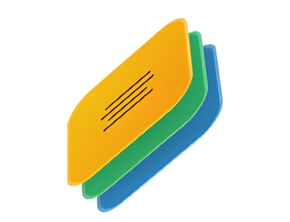

# Notiee - Your Smart Daily Companion



Notiee is a modern, feature-rich Flutter application that serves as your smart daily companion for managing todos, notes, and bills. Built with clean architecture principles and powered by Firebase, it offers a seamless and beautiful **neumorphic design** experience with real-time synchronization across all platforms.

## ✨ Features

### 🚀 **Latest Updates**
- **✅ Neumorphic Design System**: Complete UI transformation with soft, tactile 3D design elements
- **✅ Group Bill Management**: Advanced bill splitting with contact integration and month-based organization
- **✅ Notes Management**: Complete notes system with colors, tags, and pinning
- **✅ Enhanced Profile**: Comprehensive profile management with social links and expandable sections
- **✅ Smart Navigation**: Three-tab system with floating FAB and improved user experience
- **✅ Advanced Authentication**: Password strength validation and secure updates with neumorphic login/signup
- **✅ Contact Integration**: Real device contacts with permission handling for group creation
- **✅ External URL Support**: Seamless external link opening capabilities

### 🎨 **Neumorphic Design System**
- **Soft Shadows**: Multi-layered shadow system with light source from top-left
- **Extruded Elements**: 3D-like buttons, cards, and interactive components
- **Consistent Color Palette**: 
  - Background: `#E6EBEF` (soft light gray)
  - Primary: `Colors.redAccent.shade100` with gradients
  - Text: `#2E3A4B` (dark blue-gray) / `#7C8BA0` (medium gray)
  - Hints: `#9EA8B5` (light gray)
- **Tactile Interactions**: Soft-pressed button effects and responsive feedback
- **Rounded Corners**: 12-20px radius for modern, friendly appearance
- **Gradient Accents**: Primary buttons and indicators with depth effects

### 🔐 **Authentication System**
- **Phone-based Authentication**: Neumorphic login/signup using phone numbers
- **Firebase Authentication**: Secure backend authentication with Firestore integration
- **Password Protection**: Encrypted password storage with strength validation
- **Neumorphic Forms**: Soft-extruded input fields with floating labels
- **Auto-Navigation**: Smart routing based on authentication state
- **Session Management**: Persistent login sessions with proper error handling

### 📋 **Todo Management**
- **Neumorphic Cards**: Soft-extruded todo cards with priority color accents
- **Create & Edit Todos**: Neumorphic forms with title, description, and priority levels
- **Smart Checkboxes**: Custom neumorphic completion indicators
- **Priority System**: High, Medium, Low priority with enhanced color-coded indicators
- **Reminder Dates**: Date/time picker with neumorphic design
- **Action Buttons**: Soft-pressed edit/delete buttons with tactile feedback
- **Tab Organization**: Enhanced tabs for Ongoing, Completed, and Notes
- **Real-time Sync**: Live updates across devices via Firebase Firestore

### 📝 **Notes Management**
- **Neumorphic Editor**: Soft-extruded input fields for rich note creation
- **Color Coding**: 8 beautiful color themes with neumorphic color picker
- **Pin Functionality**: Enhanced pinned notes with visual depth
- **Tag System**: Neumorphic tag chips with custom styling
- **Grid Layout**: Soft-shadowed cards in optimized 2-column grid
- **Smart Organization**: Visual separation between pinned and regular notes
- **Real-time Sync**: Instant synchronization with neumorphic loading states

### 💰 **Bills & Group Management**
- **Group Creation**: Neumorphic group creation with contact integration
- **Contact Integration**: Real device contacts with permission handling
- **Month Navigation**: Neumorphic month tabs with year selector
- **Group Cards**: Soft-extruded group cards with member avatars
- **Member Management**: Visual member selection with neumorphic indicators
- **Expense Tracking**: Ready for bill splitting and expense management
- **Mock Contacts**: Fallback sample contacts when permissions not granted
- **Search Functionality**: Neumorphic search interface for contacts

### 👤 **Profile Management**
- **Neumorphic Profile**: Comprehensive profile with soft-extruded sections
- **Expandable Developer Info**: Animated expandable section with social links
- **Password Management**: Neumorphic password forms with strength indicators
- **Field Editing**: Individual field editing with neumorphic inputs
- **Social Integration**: Direct links to GitHub, LinkedIn, Facebook, WhatsApp, Twitter, and website
- **Loading States**: Neumorphic loading indicators and feedback
- **Real-time Validation**: Enhanced form validation with visual feedback

### 🏗️ **Architecture & Technical Features**

#### **Clean Architecture**
- **Domain Layer**: Business logic and entities with clear boundaries
- **Application Layer**: BLoC state management with reactive patterns
- **Infrastructure Layer**: Firebase, Firestore, and external data sources
- **Presentation Layer**: Neumorphic UI components and pages

#### **State Management**
- **Flutter BLoC**: Reactive state management across all features
- **Event-driven**: Predictable state changes through events
- **Stream-based**: Real-time UI updates with proper error handling
- **State Persistence**: Maintains state across navigation

#### **Backend & Data**
- **Firebase Core**: Backend infrastructure with proper configuration
- **Firestore**: NoSQL database with optimized queries and security rules
- **Firebase Auth**: User authentication with phone-based login
- **Real-time Sync**: Automatic data synchronization across devices
- **Contact Access**: Device contacts integration with permission handling

#### **Dependencies**
- **GetIt**: Service locator for clean dependency injection
- **Dartz**: Functional programming with Either types for error handling
- **Flutter Contacts**: Device contact access with permissions
- **URL Launcher**: External link opening capabilities
- **Crypto**: Secure password hashing
- **Flutter SVG**: Vector graphics support

## 📱 **Application Flow**

### **Navigation Structure**
```
├── Splash Screen (/)
├── Authentication
│   ├── Login Page (/login) - Neumorphic design
│   └── Signup Page (/signup) - Neumorphic design
├── Main Navigation (/main)
│   ├── Todos Tab - Three sub-tabs (Ongoing, Completed, Notes)
│   └── Bills Tab - Group management with month navigation
├── Todo Management
│   ├── Add/Edit Todo (/add_edit_todo) - Neumorphic forms
│   └── Add/Edit Note (/add_edit_note) - Neumorphic editor
├── Bills Management
│   └── Create Group - Contact integration
└── Profile (/profile) - Neumorphic profile with social links
```

### **Smart FAB Menu**
- **Animated FAB**: Floating action button with rotation animation
- **Context Menu**: Add Todo and Add Note options
- **Neumorphic Design**: Soft-pressed interaction feedback

## 🛠️ **Tech Stack**

### **Frontend**
- **Flutter** (SDK ^3.5.3)
- **Dart** (Latest stable)
- **Neumorphic Design System** (Custom implementation)

### **State Management**
- **flutter_bloc** ^9.1.1
- **equatable** ^2.0.5

### **Backend & Database**
- **Firebase Core** ^4.1.0
- **Firebase Auth** ^6.0.2
- **Cloud Firestore** ^6.0.1

### **Contacts & Permissions**
- **flutter_contacts** ^1.1.9
- **permission_handler** ^12.0.1

### **Architecture & Utils**
- **get_it** ^8.2.0 (Dependency Injection)
- **dartz** ^0.10.1 (Functional Programming)
- **crypto** ^3.0.3 (Password Hashing)
- **flutter_svg** ^2.2.0 (SVG Support)
- **url_launcher** ^6.1.14 (External URL Support)
- **http** ^1.2.2 (HTTP Requests)

### **Development**
- **flutter_lints** ^6.0.0
- **flutter_test** (Testing framework)

## 🚀 **Getting Started**

### **Prerequisites**
- Flutter SDK (^3.5.3)
- Dart SDK (Latest)
- Firebase Project Setup
- Android Studio / VS Code
- iOS/Android development environment

### **Installation**

1. **Clone the Repository**
   ```bash
   git clone [repository-url]
   cd notiee
   ```

2. **Install Dependencies**
   ```bash
   flutter pub get
   ```

3. **Firebase Setup**
   - Create a Firebase project
   - Enable Authentication (Phone & Email/Password)
   - Enable Firestore Database
   - Add Android/iOS apps to Firebase
   - Download and place configuration files:
     - `android/app/google-services.json`
     - `ios/Runner/GoogleService-Info.plist`
   - Configure Firestore security rules for authentication queries
   - Run FlutterFire configure:
     ```bash
     flutterfire configure
     ```

4. **Permissions Setup (Android)**
   - Add contacts permission in `android/app/src/main/AndroidManifest.xml`:
     ```xml
     <uses-permission android:name="android.permission.READ_CONTACTS" />
     ```

5. **Run the App**
   ```bash
   flutter run
   ```

### **Building for Production**

#### **Android**
```bash
flutter build apk --release
# or for app bundle
flutter build appbundle --release
```

#### **iOS**
```bash
flutter build ios --release
```

## 📁 **Project Structure**

```
lib/
├── core/                          # Core utilities and shared components
│   ├── di/                        # Dependency injection setup
│   ├── errors/                    # Error handling and failures
│   └── utils/                     # Utility functions and constants
├── features/                      # Feature-based modules
│   ├── authentication/            # User authentication
│   │   ├── application/           # BLoC and business logic
│   │   ├── domain/               # Entities and repository contracts
│   │   ├── infrastructure/       # Data sources and implementations
│   │   └── presentation/         # Neumorphic UI components and pages
│   ├── todo/                     # Todo & Notes management
│   │   ├── application/          # Todo & Note BLoCs and events
│   │   │   ├── todo_bloc/        # TodoBloc with state management
│   │   │   └── note_bloc/        # NoteBloc with state management
│   │   ├── domain/              # Todo & Note models and contracts
│   │   │   ├── models/          # TodoModel & NoteModel
│   │   │   └── repositories/    # Repository interfaces
│   │   ├── infrastructure/      # Firestore implementations
│   │   └── presentation/        # Neumorphic Todo & Note UI
│   │       ├── pages/          # List, Add/Edit pages with neumorphic design
│   │       └── widgets/        # Reusable neumorphic components
│   ├── bills/                   # Bills & Group management
│   │   ├── application/         # Bill BLoC and events
│   │   ├── domain/             # Group & Contact models
│   │   │   ├── models/         # GroupModel, ContactModel
│   │   │   └── repositories/   # Group repository interface
│   │   ├── infrastructure/     # Firestore & Contacts implementation
│   │   └── presentation/       # Neumorphic Bills UI
│   │       ├── pages/         # Bills, Create Group pages
│   │       └── widgets/       # Group cards, Month tabs
│   └── profile/                # User profile management
│       ├── application/        # Profile BLoC and events
│       ├── domain/            # Profile models and contracts
│       ├── infrastructure/    # Profile data implementation
│       └── presentation/      # Neumorphic Profile UI
├── main.dart                   # App entry point with theme configuration
├── home.dart                  # Main navigation with neumorphic FAB
├── splash_screen.dart         # Animated splash screen
└── firebase_options.dart      # Firebase configuration
```

## 🎯 **Key Features in Detail**

### **Neumorphic Design Implementation**
- **Consistent Design Language**: All UI elements follow neumorphic principles
- **Custom Helper Methods**: Reusable neumorphic containers, buttons, and inputs
- **Shadow System**: Carefully crafted multi-layer shadows for depth
- **Color Harmony**: Cohesive color palette across all screens
- **Interactive Feedback**: Subtle animations and state changes

### **Authentication Flow**
- **Phone-based Login**: Secure authentication with Firebase
- **Neumorphic Forms**: Soft-extruded input fields with validation
- **Error Handling**: Proper error states with user-friendly messages
- **Session Management**: Persistent authentication state

### **Todo & Notes System**
- **CRUD Operations**: Complete Create, Read, Update, Delete functionality
- **Real-time Sync**: Live updates across devices
- **Rich Editor**: Enhanced note creation with color coding and tags
- **Visual Organization**: Priority indicators, completion states, and filtering

### **Bills & Group Management**
- **Contact Integration**: Real device contacts with permission handling
- **Group Creation**: Multi-member group setup with role management
- **Month Organization**: Time-based group categorization
- **Member Management**: Visual member selection and avatar display

### **Profile System**
- **Comprehensive Management**: Full profile editing capabilities
- **Social Integration**: Developer contact information and links
- **Security Features**: Password management with strength validation
- **Expandable Sections**: Animated UI elements for better organization

## 🔮 **Future Enhancements**

### **Planned Features**
- [ ] **Expense Tracking**: Individual bill management within groups
- [ ] **Bill Splitting**: Automated expense division among group members
- [ ] **Push Notifications**: Reminder notifications for todos and bills
- [ ] **Dark Theme**: Neumorphic dark mode implementation
- [ ] **Offline Sync**: Offline capability with background synchronization
- [ ] **File Attachments**: Image and document support for notes
- [ ] **Advanced Filtering**: Search and filter across all content
- [ ] **Data Export**: Backup and export functionality
- [ ] **Voice Input**: Voice-to-text for quick note creation
- [ ] **Collaborative Features**: Shared todos and group notes

### **Technical Improvements**
- [ ] **Comprehensive Testing**: Unit, widget, and integration tests
- [ ] **Performance Optimization**: Image caching and lazy loading
- [ ] **Accessibility**: Screen reader support and accessibility features
- [ ] **Internationalization**: Multi-language support
- [ ] **Analytics**: User engagement and app usage analytics
- [ ] **Crash Reporting**: Automated error tracking and reporting
- [ ] **CI/CD Pipeline**: Automated testing and deployment

## 🤝 **Contributing**

We welcome contributions! Please follow these steps:

1. Fork the repository
2. Create a feature branch (`git checkout -b feature/amazing-feature`)
3. Implement changes following neumorphic design principles
4. Write meaningful commit messages
5. Push to the branch (`git push origin feature/amazing-feature`)
6. Open a Pull Request

### **Coding Standards**
- Follow Flutter/Dart style guidelines
- Maintain clean architecture principles
- Implement neumorphic design patterns consistently
- Add tests for new features
- Update documentation as needed

### **Design Guidelines**
- Use consistent neumorphic shadow patterns
- Maintain color harmony with the established palette
- Ensure responsive design across screen sizes
- Implement smooth animations and transitions

## 📄 **License**

This project is licensed under the MIT License - see the [LICENSE](LICENSE) file for details.

## 👥 **Team**

Built with ❤️ by the Notiee development team.

### **Developer Contact**
- **GitHub**: [Developer GitHub Profile]
- **LinkedIn**: [Developer LinkedIn Profile]
- **Website**: [Developer Website]
- **Email**: [Developer Email]

## 📞 **Support**

For support, email support@notiee.app or create an issue in this repository.

---

**Notiee** - *Your Smart Daily Companion with Beautiful Neumorphic Design* 🌟✨